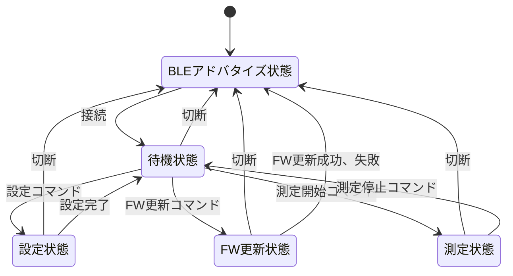

# 概要
本デバイスは、2つのGY521から得られる加速度、ジャイロデータをBLEで送信することをメイン機能としている。

# ブロック図
 ```mermaid
graph LR;
    subgraph GY521 
      i1[main]
    end
    subgraph GY521 
      i2[main]
    end

    subgraph M5Stamp
        m1[SCL,SDA]
        m2[36]
        m3[VCC]
        m4[GND]
    end

    subgraph DetectLowBat 
        d1[output]
    end

    subgraph Battery
        b1[VCC]
        b2[GND]
    end


i1 --> |I2C|m1
i2 --> |I2C|m1
d1 --> |ADC|m2
b1 --> m3
b2 --> m4
 ```
 # 状態遷移図


# BLEコマンド（スマホが送信側）
| 概要           | コマンド番号 | 引数          | 応答                         |
| -------------- | ------------ | ------------- | ---------------------------- |
|                | 2byte        | 任意byte      | 任意byte                     |
| 機器情報取得   | 0x00, 0x01   | なし          | 機器情報(json)               |
| 連続測定開始   | 0x01, 0x00   | なし          | 2つの6軸センサの値           |
| 連続測定終了   | 0x01, 0x01   | なし          | なし                         |
| Wifi SSID設定  | 0x02, 0x00   | SSID（ascii） | 設定したSSID(ascii)          |
| Wifi SSID取得  | 0x02, 0x00   | なし          | 設定したSSID(ascii)          |
| Wifi PW設定    | 0x02, 0x01   | PW(ascii)     | 設定したPW(ascii)            |
| Wifi IP取得    | 0x02, 0x02   | なし          | ネット接続時:IP、未接続:None |
| Wifi 接続      | 0x02, 0x03   | なし          | ネット接続時:IP、未接続:None |
| FW更新         | 0x03, 0x00   | なし          | 更新開始：0x01,不必要:0x00   |
| FW更新Host設定 | 0x03, 0x01   | Host(ascii)   | 設定したHost(ascii)          |
| FW更新Host取得 | 0x03, 0x01   | なし          | 設定したHost(ascii)          |


# 1測定データのサイズ
## 1サンプリング
2byte * 6(acc+gyro) * 2(センサ) = 24byte
※測定時に加速度・ジャイロのスケールのRangeを取得しておくように。

## 100Hzで1分間測定
24byte * 100 = 2400byte = 2.4kB/sec
2.4kB * 60 = 144 kB

RAM:   [==        ]  16.8% (used 55108 bytes from 327680 bytes)
Flash: [========  ]  78.4% (used 1541181 bytes from 1966080 bytes)