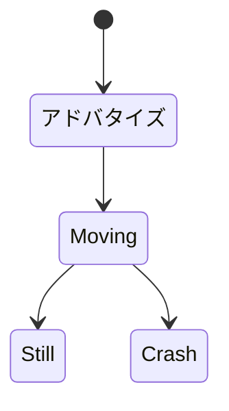

# 概要
本デバイスは、2つのGY521から得られる加速度、ジャイロデータをBLEで送信することをメイン機能としている。

# ブロック図
 ```mermaid
graph LR;
    subgraph GY521 
      i1[main]
    end
    subgraph GY521 
      i2[main]
    end

    subgraph M5Stamp
        m1[SCL,SDA]
        m2[36]
        m3[VCC]
        m4[GND]
    end

    subgraph DetectLowBat 
        d1[output]
    end

    subgraph Battery
        b1[VCC]
        b2[GND]
    end


i1 --> |I2C|m1
i2 --> |I2C|m1
d1 --> |ADC|m2
b1 --> m3
b2 --> m4
 ```
 # 状態遷移図



